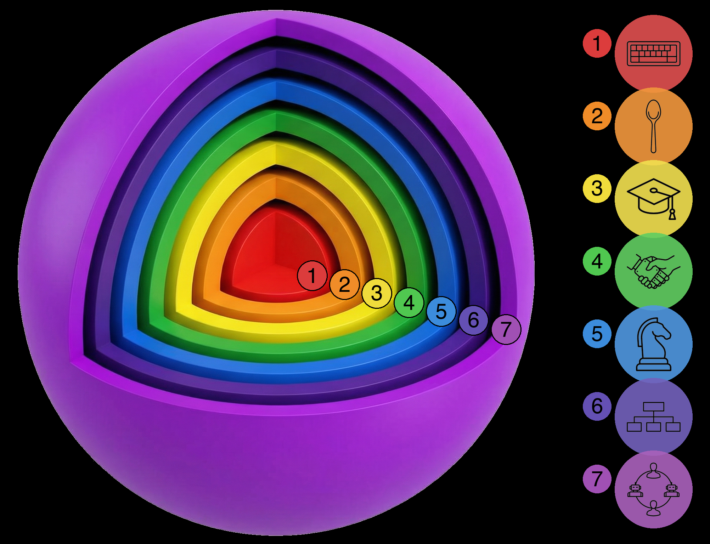

# The Seven Spheres of Human-AI Co-Development

By Waleed Kadous : published 2026-02-10
Original: https://cluesmith.com/blog/seven-spheres

**TL;DR:** I've been talking to a lot of developers about how they use AI. What's striking isn't the tools they use, it's how differently they work with them. Some treat AI like fancy autocomplete. Others have AI managing other AIs. These aren't just preferences. They're different spheres of operation, and each one has a different perspective. This is leading to a lot of confused conversations where people talk past each other. Hopefully this guide can (a) help bridge the gap between different spheres (b) invite you to join us as we explore the outer spheres together.

---

I've had dozens of conversations about AI-assisted software development over the past few months. Engineers, founders, students, skeptics: people building production systems, real software that ships. What I keep noticing is that people aren't really talking about the same thing when they say "I use AI for development." One person means they hit Tab to accept Copilot suggestions. Another means they have an AI agent decomposing their project into specs while spawning other agents to implement them in parallel. These are not the same activity. They're not even close.

So I started thinking about this as a series of expanding spheres. Not a ranking of who's "better," but a map of different modes of working. Each sphere encompasses the ones inside it. As you expand outward, you're not abandoning the inner spheres: you're adding new capabilities while keeping the old ones.

## Sphere 1: Turbo Typist

This is smart autocomplete. Copilot, Codeium, whatever your editor offers. The AI predicts your next few tokens or lines. You hit Tab. Repeat.

You're still steering the ship. The AI just hands you rope.

## Sphere 2: Spoon-feeder

Here you start giving AI discrete, bounded tasks. Write this one test. Create this one class. Generate this regex. You specify exactly what you want, the AI produces it, you review it and move on.

Think of it as a very literal assistant. "Make me a sandwich" works. "Figure out what I should eat" does not. You're spoon-feeding the AI one bite at a time: small, well-defined units of work with no room for ambiguity.

## Sphere 3: Intern

Now we're at project scope. You trust the AI to build considerably bigger components. A feature that touches both frontend and backend. A refactor across multiple files. Something that requires holding more context than a single function.

I call this the "Intern" sphere because you're still the architect. You expect the AI to come to you when it gets stuck. You review everything. But you're delegating real work, not just typing.

## Sphere 4: Partner

This is where it gets interesting. In Sphere 4, you and the AI work together to construct specifications and plans. The AI isn't just executing your designs. It's contributing to them.

You might describe a problem and ask the AI how it would approach the architecture. You have a back-and-forth about tradeoffs. Sometimes the AI suggests something you hadn't considered, and (this is the uncomfortable part) it's actually better than what you had in mind. Importantly, you're open to its suggestion.

The shift here is subtle but profound. Spheres 1 through 3 are about trusting AI to execute your ideas correctly. Sphere 4 is about trusting AI to have ideas worth considering.

That's a fundamentally different kind of trust. It's not "can AI write code?" It's "can AI think about architecture?" A lot of engineers stall here, not because they're incapable, but because trusting a bot with architecture feels like letting your Roomba rearrange your furniture.

## Sphere 5: Chess Grandmaster

In this sphere, you run multiple agents simultaneously. When one is busy thinking or executing, you switch to another. Like a chess grandmaster playing multiple games at once, you're the one moving between boards while each opponent considers their next move.

The aha moment is realizing you're the traffic jam. The AI can work while you're grabbing coffee, so why sit there watching the cursor blink? Once you see it, it's hard not to become a multi-table chess hustler.

This requires Sphere 4 (Partner) trust, just multiplied. If you don't trust a single agent to co-design with you, you certainly won't trust three of them running in parallel. But it also requires strong context-switching capabilities. I can handle two agents easily, three with focus and mental effort, but four breaks my brain. I start confusing which agent is doing what and accidentally tell one to do the other's job.

## Sphere 6: Chief of Staff

In Sphere 6, you and the AI work together to get things done. You spawn different sub-AIs to solve problems. You and the AI make sure all the pieces produced by the sub-agents fit together and fulfill the goals. Sometimes you'll ask the AI (just like you would your Chief of Staff) "OK, what's on the agenda now? What's next?"

You're the big-picture human who names the mountain. Your AI team handles the Sherpa work. You review output, make judgment calls, and course correct. But you're not in the details of every decision.

## Sphere 7: The Hybrid Team

Spheres 1 through 6 are all about how one person relates to AI. But what happens when it's a team?

In Sphere 7, you have combined teams of humans and AIs working together. Multiple humans, each potentially operating at different spheres, coordinating with multiple AI agents. The question shifts from "how do I use AI?" to "how do we make this hybrid team productive?"

This is largely unexplored territory. How do you onboard a team where some members are at Sphere 3 and others are at Sphere 6? How do you structure code review when some PRs are human-written, some are AI-written, and some are collaborative? How do you divide work between humans and AI agents on the same project?

I don't have all the answers here. But I know this is where the frontier is heading. The individual productivity gains from Spheres 4-6 are significant. The team-level gains from figuring out Sphere 7 could be transformational.

## Why People Get Stuck

Expanding into a new sphere requires a leap of faith that your current sphere didn't prepare you for. And some of those leaps are harder than others.

There's a fascinating detail in how Google used to run promotions. For decades, when promoting engineers from Level 3 to Level 4, the committee wasn't composed of Level 4 engineers. Google found that L4s got obsessive about comparing candidates to themselves, which didn't lead to fair evaluations. Instead, the promotion committee consisted of Level 5 engineers: people far enough removed to see the bigger picture. (Google changed this system in 2022, but the insight remains.)

The same dynamic plays out with AI adoption. As Upton Sinclair put it: "It is difficult to get a man to understand something when his salary depends on his not understanding it." When you're sitting in Sphere 3 (Intern), evaluating whether AI can do more than what you're already using it for, there's a strong temptation to conclude: "Nope, this is the ceiling. No way some AI is better than me at the hard stuff."

There's also a local minimum problem. In Sphere 3, the AI produces code that's fine, but it's not remarkably different from what you'd write yourself. If it's not different, why would you use it for anything more than you already are? It's easy to conclude that AI can't do more than what it's currently doing: because at this level, the evidence supports that view.

Sphere 3 feels like the edge of the universe because Sphere 4 requires a different kind of trust. In Sphere 3, you're still the architect and the AI is just a faster typist. That's a comfortable identity. Sphere 4 asks you to treat the AI as a thinking partner, and that's threatening in a way that faster typing isn't.

The expansion from Sphere 3 to Sphere 4 is the hardest. It's where most people stop, and where the real leverage begins.

The jump from Sphere 4 to Sphere 5 is obvious for most people once they've made the partner leap. Sphere 5 to Sphere 6 is a reaction to realizing your own context-switching limitations. And Sphere 6 to Sphere 7? That's the frontier. Nobody quite knows how to do this yet.

## What This Looks Like in Practice

I've been building a system called [codev](https://github.com/cluesmith/codev) that operates in Sphere 6. It uses what I call the Architect-Builder pattern.

I work together with an AI agent as the Architect. I decide what work needs to be done. The Architect and I convert that into specs and plans. We spawn Builder agents in isolated git worktrees to implement the specs. The Builders work independently. We review, integrate, and manage the process. AI is literally managing AI.

Being in Sphere 6 has been an epiphany for me. You really start to think about things differently. Recently I realized that one way to help people understand how to use codev would be to write a book about it. I realized that if I could structure the content, the AI could probably read through the existing source code and artifacts and put together a first draft. There would be 11 chapters. I could spawn a separate AI to write each chapter.

So I did. The first draft was finished in under an hour.

I still have to proofread every single word and add diagrams. That'll still take me about a fifth of the time it would have otherwise. But the very idea that you could wake up in the morning thinking "I should write a codev book!" and by afternoon have a rough but workable starting point: that has never happened in history before.

If you approach [codev](https://github.com/cluesmith/codev) from Sphere 2, it doesn't make sense. The questions are logical: "Why can't I just tell it what code to write?" "Why do I need specs? Just build the thing." "Why are there multiple agents? Seems overcomplicated."

These aren't wrong questions. They just come from a different sphere. Specs aren't bureaucracy; they're how the Architect chats with its Builders. Multiple agents aren't overkill; they're how you stop being the bottleneck.

It's like comparing a smartphone to a feature phone. A smartphone might actually be *worse* at making phone calls: more battery drain, more distractions, fiddlier interface. If all you want to do is make calls, the feature phone wins. But that's missing the point. The smartphone isn't trying to be a better phone. It's an entirely different category of device that happens to also make calls.

Sphere 6 tools aren't trying to be better Sphere 2 tools. They're a different way of working entirely.

## The Communication Gap

This is why "just use AI" advice often falls flat. When someone in Sphere 2 and someone in Sphere 6 both say they "use AI for coding," they're describing completely different activities. Same underlying models. Completely different relationships with them.

If you're in Sphere 2, advice from someone in Sphere 6 sounds unhinged. "Have the AI design the architecture with you?" "Run multiple agents in parallel?" "Let AI manage AI?" It only clicks once you've expanded through the intermediate spheres.

The spheres aren't about right or wrong. They're a shared vocabulary for understanding where someone is coming from. Once you know what sphere someone's operating in, their questions make sense: and you can meet them where they are.

## Quick Gut Check

Where are you on this map?

Have you ever let an AI change your mind about a design decision? Do you still audit every line of output character by character? Have you run multiple AI sessions in parallel?

No judgment here. The spheres aren't about intelligence or skill. They're about trust, and trust takes time to build.

Here's what worked for me: I took an exploratory, curiosity-driven approach. I kept asking myself, "Let me see if the AI can do X." More often than not, it could. Sometimes it couldn't do something last month, but then a new model dropped and suddenly it could. The frontier keeps moving.

The key is your framing. If you're worried about AI replacing you, you're not incentivized to push it to its limits: all that does is increase your stress level. But if you're focused on how AI can augment you and make you more effective, you *are* incentivized to push it. You want to find out what's possible.

Jensen Huang said that people won't be replaced by AI: they'll be replaced by people who know how to use AI. There's a corollary to that: people who use AI more extensively and effectively will replace those who don't.

I realize this might sound like flexing: "look at me, I'm at Sphere 6!" That's not the intent. It's more like snorkeling a coral reef. Someone's wading in the shallows thinking *this is nice*, and I'm out past the reef shouting back: "You have to see what's out here!"

The water's fine. Come explore the outer spheres: and let's swim out further together.

---

*I would like to thank Brian Stanley. Talking to him about how to help his engineering teams inspired this article.*

*This article was written with AI in Sphere 4. Some of the analogies (the smartphone/feature phone comparison, the Roomba rearranging furniture) came from the AI. I have read and reviewed every word and am fully responsible for the content.*
